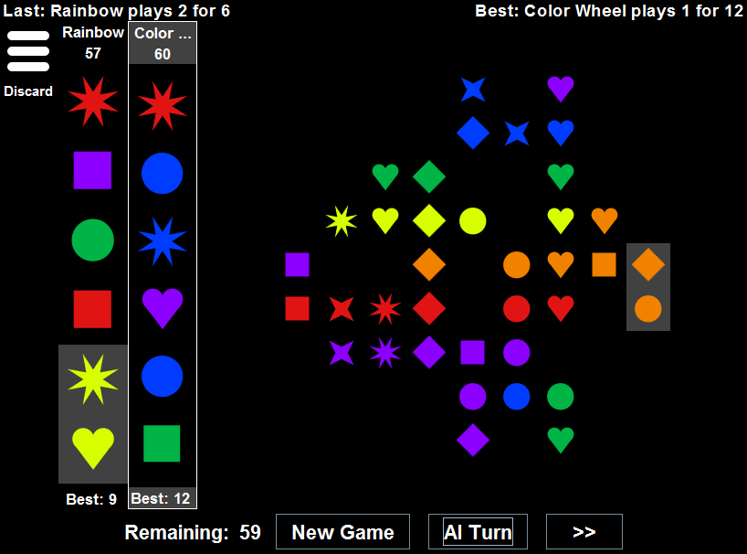

# Kind of like Qwirkle

An implementation of the boardgame [Qwirkle by
MindWare](http://mindware.com/qwirkle-a2-32016.fltr).
Originally written as a teaching aid for an AP computer science class.

## Try it out ...

#### ... Using [Gradle](http://gradle.org/)

    $ git clone https://github.com/neolefty/kind-of-like-qwirkle
    $ cd kind-of-like-qwirkle
    $ gradle runSwing

#### ... Or in an IDE

1. Include these two source dirs:
  * `src/main/java/`
  * `src/swing/java/`
2. Grab the dependency on guava 19 (it's referenced in build.gradle)
3. Run the class `qwirkle.ui.swing.main.SwingMain`

## In a classroom

Students can

* Make new tile shapes
* Write AIs (but first, hide MaxPlayer from them)
* Draw doodles and animations
* Change the game rules

There's a Java Swing UI, but it's fairly well separated from the game
logic, so it should be possible to write other UIs.

## To Do

* Make the human player interface more graceful.
  It's too AI-centric.
* Add network play.
* Port to other platforms (Android, web, robo-vm)
* ... talk to MindWare (publisher of Qwirkle) about permission?

## Tests

* Unit tests cover the game internals, UI controllers, and benchmarking,
but not the graphical parts of the UI. 
* See the executable classes in [src/test/java](src/test/java/qwirkle/test). They
don't use a framework (JUnit etc) -- just assertion
failures. Converting to a unit test framework would be a good project
for the future.